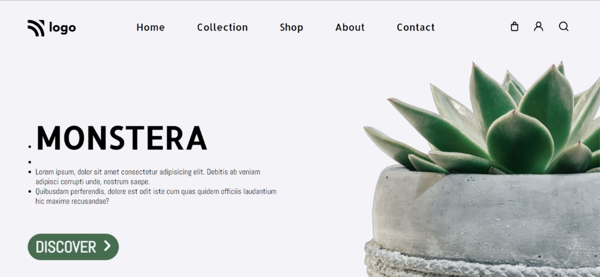

# Plant Home Page

Made by **Omprasad Dornala**

## Description

This is a sample web page. This website  focuses on positioning of elements and image.

## Built with

- Semantic HTML
- CSS

## Key learnings

- Absolute positioning of elements.
- To create a navbar with icons.

## Time taken

- This project took me more than one hour of time.

## Deployed Version Link

- [Live Demo](https://plant-home-page-op.netlify.app/)

## Snapshot of Webpage

